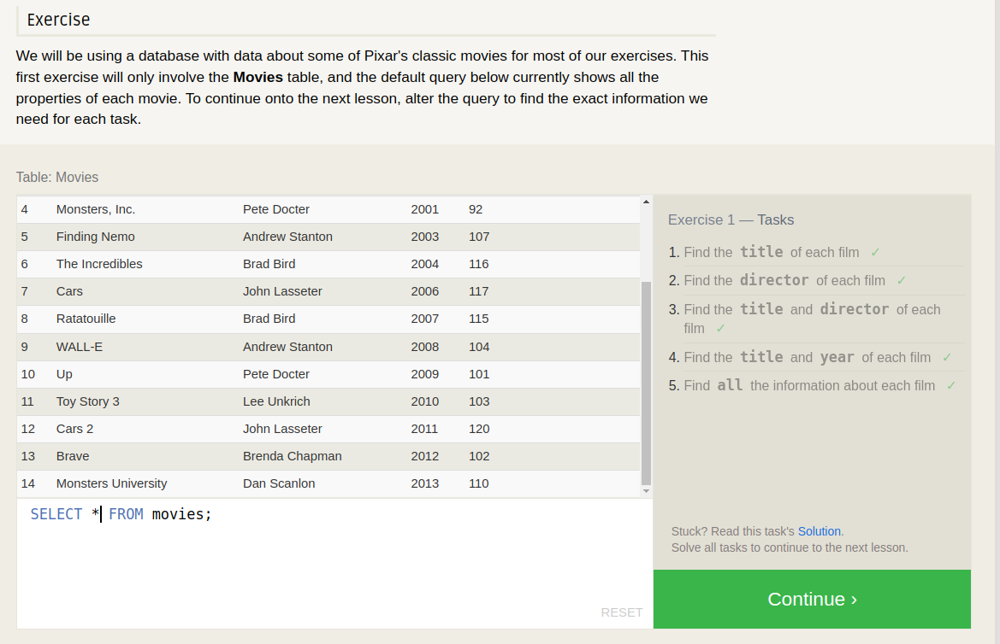

# Introduction to SQL

## Summarizing your understanding of relational databases and SQl

Relational databases are a type of database management system that organizes data into tables or relations, with each table containing data related to a specific entity or concept. These tables are linked by common fields or attributes, which are used to create relationships between them.

SQL (Structured Query Language) is a programming language used to interact with relational databases. It allows users to retrieve, manipulate, and manage data stored in a relational database system. SQL is used to create and modify database structures, insert and update data, and retrieve data based on specific criteria.

In summary, relational databases and SQL provide a powerful and flexible way to store and manage large amounts of structured data. They are widely used in a variety of industries, including finance, healthcare, and e-commerce, to manage and analyze large volumes of data efficiently and effectively.

### Fowllow the link: https://sqlbolt.com/

